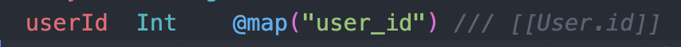
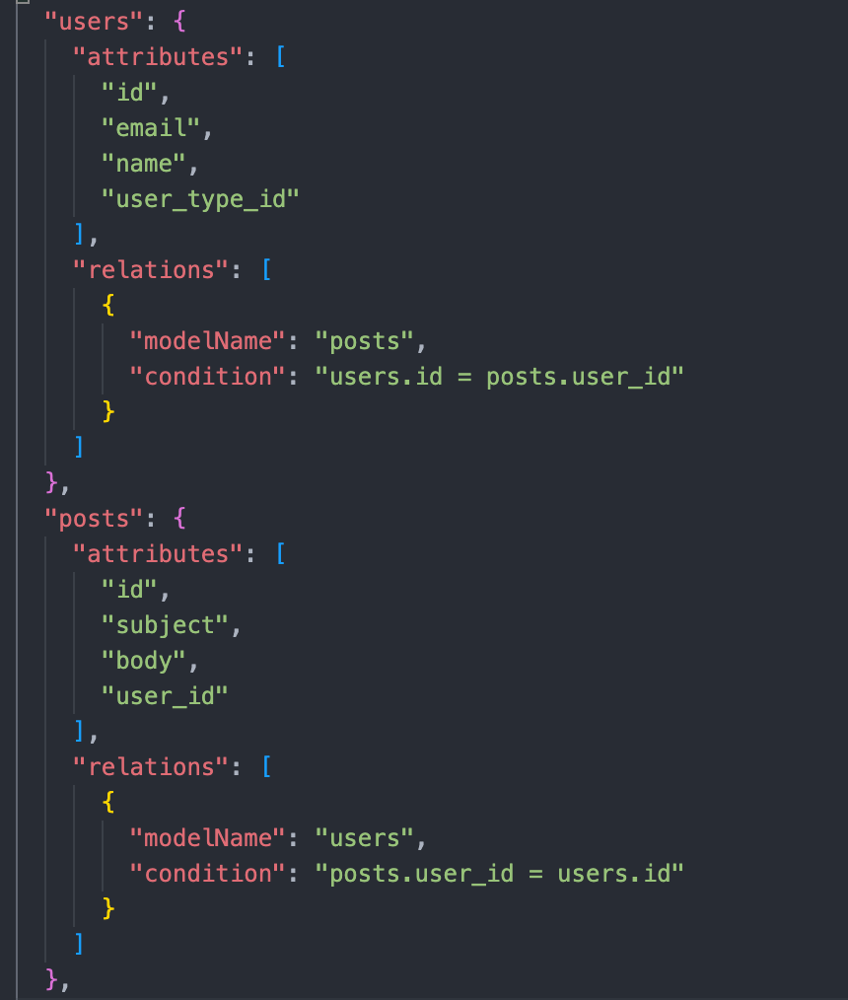

# Prisma Models Graph Generator

> This generator was bootstraped using [create-prisma-generator](https://github.com/YassinEldeeb/create-prisma-generator)

Generates a bi-directional models graph for schema without strict relationship defined in the schema, works via a custom schema annotation.

## Getting Stared

**1. Install**
npm:

```shell
npm install prisma-models-graph
```

**2. Add the generator to the schema**

```prisma
generator jsonSchema {
  provider = "prisma-models-graph"
}
```

Additional options

```prisma
generator jsonSchema {
  provider = "prisma-models-graph"
  output = "./customOutputs"
  fileName = "custom.json"
}
```

## Usage

- Add custom relation annotation next to the field you want annotate relationship.
- Format: `/// [[<Relation Model>.<Relation Model Attribute>]]`
  

- With the above annotation, the generated models graph will be like this:
  
